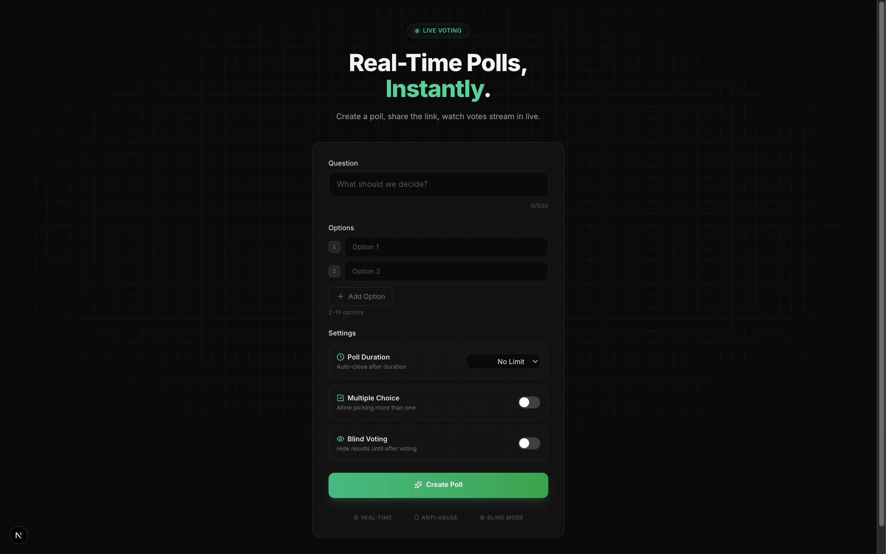
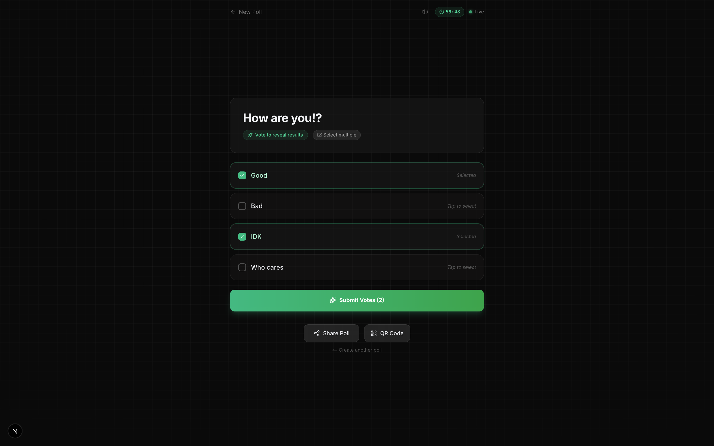
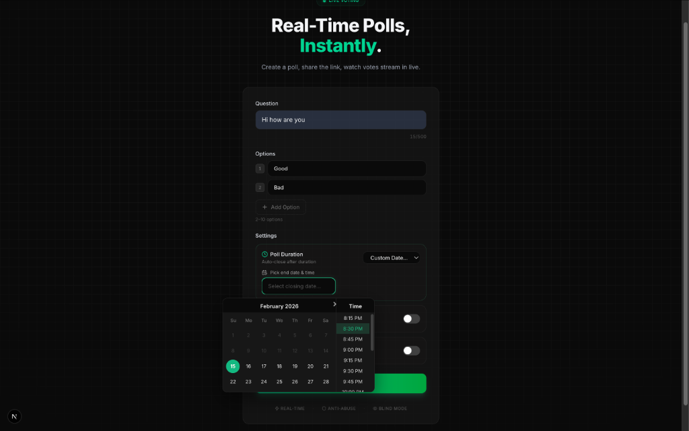
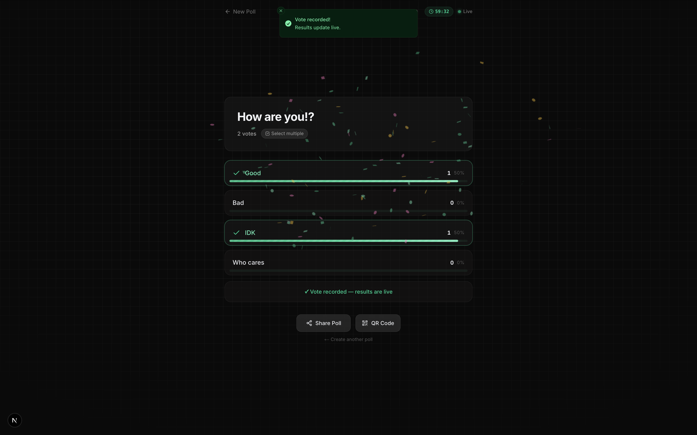
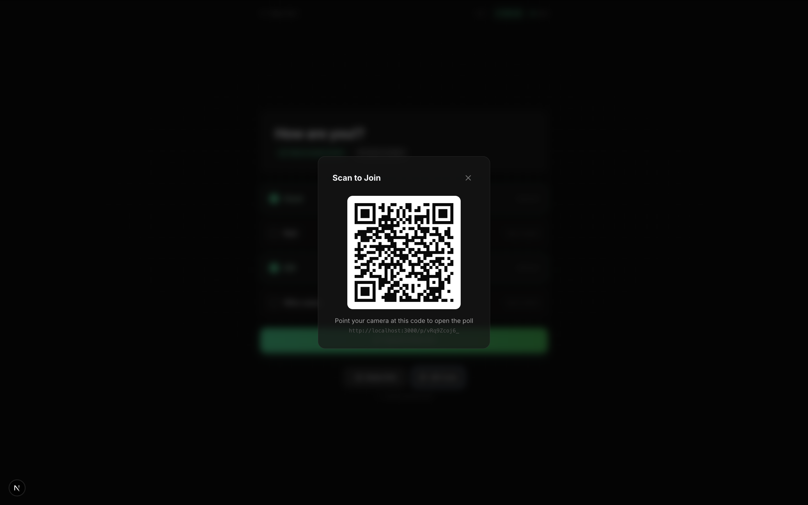
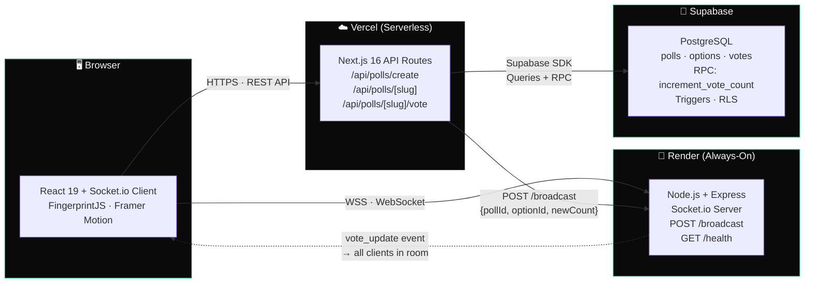

<p align="center">
  
</p>

<h1 align="center">⚡ PollRooms — Real-Time & Distributed</h1>

<p align="center">
  <a href="https://nextjs.org/"></a>
  <a href="https://www.typescriptlang.org/"></a>
  <a href="https://socket.io/"></a>
  <a href="https://supabase.com/"></a>
  <a href="https://vercel.com/"></a>
  <a href="https://render.com/"></a>
  
  
</p>

<br/>

<p align="center">
  <strong>The "Menti-Killer."</strong> Instant polling with <strong>&lt;50ms latency</strong>, military-grade anti-abuse, and cyber-organic aesthetics.<br/>
  No sign-up. No paywall. Just decisions — made together, in real time.
</p>

---

## 🟢 Live Demo

<p align="center">
  <a href="https://poll-rooms.vercel.app">
    
  </a>
</p>

<p align="center">
  <sub><em>🌐 Live at <strong>poll-rooms.vercel.app</strong> — Frontend on Vercel Edge · Socket Server on Render · Database on Supabase</em></sub>
</p>

---

## 📸 The Experience

<table width="100%">
  <tr>
    <td width="50%" align="center">
      
      <br/>
      <sub><strong>🏠 Home — Create a Poll</strong></sub>
      <br/>
      <sub>Glassmorphism form on a cyber-organic grid. Dynamic option inputs, smart scheduling presets, and a pulsing "LIVE VOTING" beacon.</sub>
    </td>
    <td width="50%" align="center">
      
      <br/>
      <sub><strong>⚡ Live Voting — Blind Mode</strong></sub>
      <br/>
      <sub>Multi-select checkboxes with emerald accents, "Vote to reveal results" blind badge, live countdown timer, and QR + Share buttons.</sub>
    </td>
  </tr>
  <tr>
    <td width="50%" align="center">
      
      <br/>
      <sub><strong>📅 Smart Scheduling — Custom Date & Time</strong></sub>
      <br/>
      <sub>Dark-themed <code>react-datepicker</code> with emerald accents — full calendar + scrollable time slots. "Custom Date…" mode with Multi-Select & Blind Voting toggles.</sub>
    </td>
    <td width="50%" align="center">
      
      <br/>
      <sub><strong>🏆 Golden Winner — Confetti</strong></sub>
      <br/>
      <sub>Poll expires → emerald gradient bars reveal results → <code>canvas-confetti</code> erupts → toast confirms "Vote recorded! Results update live."</sub>
    </td>
  </tr>
</table>

<br/>

<p align="center">
  
  <br/>
  <sub><strong>📱 QR Code Modal — "Scan to Join"</strong></sub>
  <br/>
  <sub>One-tap QR generation for instant mobile participation. Point your camera → join the poll.</sub>
</p>

---

## 🏗️ System Architecture

> **Split-Stack Design** — The frontend lives on Vercel's edge network, the WebSocket server runs as an always-on process on Render, and Supabase provides managed PostgreSQL. They communicate via a clean `/broadcast` HTTP bridge.



**The Vote Flow (4 steps, <50ms end-to-end):**

| Step | What Happens | Where |
|------|-------------|-------|
| **1** | User clicks an option → Optimistic UI update (bar moves instantly) | Client |
| **2** | `POST /api/polls/[slug]/vote` — validates poll, checks fingerprint, checks IP | Vercel |
| **3** | `INSERT INTO votes` + `RPC increment_vote_count` (atomic) → `POST /broadcast` | Vercel → Render |
| **4** | Socket.io emits `vote_update` to all clients in `poll:{id}` room | Render → All Clients |

---

## ✨ 11/10 Features

### ⚡ The "Pulse" Engine
Custom Socket.io server **separated from Next.js** for true stateful WebSocket connections. Vercel's serverless functions are stateless — they can't hold open sockets. Our dedicated Node.js process on Render manages persistent room-based pub/sub, handles reconnections, and exposes a `/health` endpoint for uptime monitoring.

### 🛡️ The Fortress (Anti-Abuse)
**Dual-layer protection** that creates serious friction for manipulation:

| Layer | Technology | What It Prevents | How It Works |
|-------|-----------|-------------------|-------------|
| **1. Device Fingerprinting** | `@fingerprintjs/fingerprintjs` | Same device voting twice | Generates a stable hash from 50+ browser signals (canvas, WebGL, screen, timezone). Stored per-poll in PostgreSQL with `UNIQUE(poll_id, voter_fingerprint)`. Falls back to SHA-256 of manual browser properties if FingerprintJS fails. |
| **2. IP Rate Limiting** | Sliding window (10 min) | Bot attacks, VPN hopping | Checks `votes` table for any vote from the same IP within the last 10 minutes. Returns `429 Too Many Requests` with `Retry-After` header. Uses server-side UTC timestamps — never trusts the client clock. |

### 🙈 Blind Voting
Toggle `results_hidden` on poll creation to **hide all vote counts and bars until the poll expires**. This eliminates the ["Bandwagon Effect"](https://en.wikipedia.org/wiki/Bandwagon_effect) — voters commit to their genuine preference without being swayed by the crowd. When the deadline hits, all results are revealed simultaneously.

### 📅 Time Travel (Smart Scheduling)
Precise deadline control with custom-styled dark emerald calendar:
- **Presets:** `10 min` · `1 hour` · `24 hours` · `No Limit`
- **Custom:** Full `react-datepicker` with date + time selection, past-date rejection, and emerald-themed dark mode styling
- **Enforcement:** Server-side expiration check on every vote — `new Date()` on the server, never the client

### 🏆 Gold Mode
When the clock hits zero, the winning option gets the full ceremony:
- `canvas-confetti` burst 🎉 (triggered once via `useEffect` on expiry detection)
- Gold gradient vote bar (`linear-gradient(90deg, #eab308, #fbbf24, #fde68a)`)
- 🏆 Trophy icon + ambient glow effect
- Haptic click sound via `use-sound`

### 📱 Native Bridge
- **QR Code Modal** — `react-qr-code` renders the poll URL for instant mobile scanning
- **Native Share Sheet** — uses `navigator.share()` on supported devices
- **Sound Feedback** — subtle click/vote SFX with a mute toggle
- **Clipboard Fallback** — 3-tier copy strategy (Clipboard API → Share API → `<textarea>` + `execCommand`)

---

## 🐛 Edge Cases Solved — The "Senior" Section

> These aren't hypothetical. Every one was encountered, debugged, and patched.

### 🧟 The Zombie Socket
**Problem:** Laptop sleeps → wakes up → Socket.io auto-reconnects, but the UI shows stale vote counts from hours ago.
**Fix:** On `reconnect`, the client fires a full re-fetch of `/api/polls/[slug]` to hydrate the latest authoritative data before resuming real-time updates.

### 🏎️ The Race Condition
**Problem:** 50 users vote in the same second. Naïve `read count → write count+1` loses votes due to interleaved reads.
**Fix:** `supabase.rpc('increment_vote_count')` runs `UPDATE SET vote_count = vote_count + 1 RETURNING vote_count` — a single atomic Postgres statement. No read-modify-write. No drift.

### 📋 The Clipboard Crash
**Problem:** `navigator.clipboard.writeText()` throws in non-HTTPS contexts (localhost, embedded iframes, older Android WebViews).
**Fix:** Three-tier fallback:
1. `navigator.clipboard.writeText()` — modern browsers on HTTPS
2. `navigator.share()` — mobile native share sheet
3. Temporary `<textarea>` + `document.execCommand('copy')` — the "1999 approach" that still works everywhere

### ⏳ The Timezone Trap
**Problem:** User with a misconfigured system clock bypasses poll expiration, or gets blocked from a still-open poll.
**Fix:** **Server-authoritative timestamps only.** The vote API uses `new Date()` on the server (UTC) to compare against `poll.expires_at`. Client-side countdown timers are display-only — cosmetic, never authoritative.

### 🛡️ The Array Attack
**Problem:** Malicious client sends `optionIds: "string"` instead of `["array"]`, crashing `.map()` downstream.
**Fix:** Input normalization before any processing:
```typescript
const normalizedIds = Array.isArray(rawIds)
  ? rawIds.filter(id => typeof id === 'string' && id.length > 0)
  : typeof rawIds === 'string' ? [rawIds] : [];
```

### 🔒 Database Guardrails (Defense in Depth)
Even if the app logic has a bug, Postgres triggers are the last line of defense:
- `vote_check_active` — rejects votes on inactive polls at the DB level
- `vote_validate_option` — rejects votes where `option_id ∉ poll_id`
- `UNIQUE(poll_id, voter_fingerprint)` — constraint-level duplicate prevention

---

## 🛠️ Tech Stack

| Layer | Technology | Role |
|-------|-----------|------|
| **Frontend** | Next.js 16 (App Router) + React 19 | SSR, routing, serverless API |
| **Language** | TypeScript | End-to-end type safety |
| **Styling** | Tailwind CSS 4 + Custom Design System | "Cyber-Organic" dark theme with emerald accents |
| **Real-Time** | Node.js + Express + Socket.io | Dedicated WebSocket server (Railway) |
| **Database** | PostgreSQL via Supabase | Persistent storage, RPC, RLS, triggers |
| **Anti-Abuse** | FingerprintJS + IP Sliding Window | Dual-layer vote integrity |
| **Animation** | Framer Motion | Page transitions, micro-interactions |
| **Notifications** | Sonner | Toast notifications |
| **Icons** | Lucide React | Consistent iconography |
| **Engagement** | canvas-confetti · use-sound · react-qr-code | Confetti, haptic sounds, QR sharing |
| **Scheduling** | react-datepicker | Custom deadline calendar |
| **Deployment** | Vercel (app) + Render (socket) + Supabase (db) | Split-stack, independently scalable |

---

## 🚀 Getting Started

### Prerequisites

```
Node.js 18+  ·  npm 9+  ·  Git  ·  Supabase Account (free tier)
```

### Quick Start

```bash
# 1. Clone
git clone https://github.com/pulkitpandey/poll-rooms.git && cd poll-rooms

# 2. Install dependencies (both apps)
npm install && cd socket-server && npm install && cd ..

# 3. Configure environment
cp .env.example .env.local          # Fill in Supabase credentials
cp socket-server/.env.example socket-server/.env

# 4. Setup database
#    → Go to supabase.com → SQL Editor → Paste database/schema.sql → Run

# 5. Launch (two terminals)
npm run dev                          # Terminal 1 → http://localhost:3000
cd socket-server && node index.js    # Terminal 2 → ws://localhost:3001
```

**Env Var Checklist:**

| Variable | File | Required | Description |
|----------|------|----------|-------------|
| `NEXT_PUBLIC_BASE_URL` | `.env.local` | ✅ | App origin (e.g. `http://localhost:3000`) |
| `NEXT_PUBLIC_SOCKET_URL` | `.env.local` | ✅ | Public WebSocket URL (client connects here) |
| `SOCKET_SERVER_URL` | `.env.local` | ✅ | Internal broadcast URL (API → Socket) |
| `NEXT_PUBLIC_SUPABASE_URL` | `.env.local` | ✅ | Supabase project URL |
| `NEXT_PUBLIC_SUPABASE_ANON_KEY` | `.env.local` | ✅ | Supabase anonymous key |
| `PORT` | `socket-server/.env` | ⬜ | Socket server port (default: `3001`) |
| `FRONTEND_URL` | `socket-server/.env` | ✅ | CORS origin whitelist |

---

## 📄 License

MIT — use it, fork it, ship it.

---

<p align="center">
  <sub>Built with obsessive attention to detail, defensive engineering, and way too much emerald green. 💚</sub>
</p>
